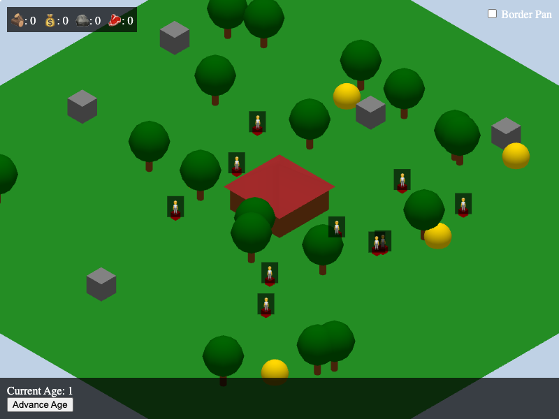

# 3D RTS Game

A simple 3D Real-Time Strategy (RTS) game built with Three.js.

## Features

*   **3D Environment:** A simple 3D world with a ground plane, a town center, and trees.
*   **Camera Controls:** The camera pans when the mouse is near the edge of the screen.
*   **Border Pan Toggle:** A checkbox in the top right corner allows you to enable/disable camera panning when the mouse is near the screen borders.
*   **Unit Selection:**
    *   Select individual units by clicking on them.
    *   Select multiple units by drawing a selection rectangle.
*   **Unit Movement:** Right-click on the ground to move selected units. Multiple units will now spread out to avoid overlapping.
*   **Resource Gathering:**
    *   Villagers can be commanded to gather wood from trees, gold from gold mines, stone from stone mines, and food from farms.
    *   Villagers will now walk to the resource if they are too far away before starting to gather.
    *   Villagers now move at a constant speed when gathering or depositing resources.
    *   Right-click on a resource to send a villager to gather it.
    *   The villager will gather the resource and return to the town center to deposit it.
    *   The villager will automatically return to the same resource to continue gathering.
*   **UI:**
    *   A UI panel at the bottom of the screen displays information about the selected unit(s).
    *   Resource counters at the top left of the screen display the town's total wood, gold, stone, and food.
    *   User-readable text in the UI has been replaced with emojis.
    *   Text above each villager displays its current status (e.g., "🧍", "🔨", "🪓", etc.).

## How it Works

The game is built using JavaScript and the Three.js library. The entire game is contained within a single `index.html` file.

*   **Three.js:** Used for creating the 3D scene, objects, and rendering.
*   **HTML/CSS:** Used for the UI elements, such as the selection box, info panel, and resource counters.
*   **JavaScript:** Used for all the game logic, including unit movement, selection, and resource gathering.
*   **Pathfinding:** The `pathfinding-js` library is used for advanced pathfinding, allowing units to avoid each other and obstacles in the scenery.

To run the game, simply open the `index.html` file in a web browser.
